# 🛒 NLP Destekli E-Ticaret Sitesi – Frontend

Bu proje, **NLP (Doğal Dil İşleme) destekli bir e-ticaret sitesinin frontend kısmını** içermektedir.  
Kullanıcı ve admin arayüzleri ayrı olacak şekilde tasarlanmıştır.

Frontend tarafında **React.js** frameworkü ve **Ant Design** bileşen kütüphanesi kullanılmıştır.

---

## 🚀 Kullanılan Teknolojiler

- **React.js**
- **Ant Design**
- JavaScript (ES6+)
- HTML5
- CSS3
- REST API entegrasyonu

---

## 👤 Kullanıcı Arayüzü Özellikleri

- Ürün listeleme ve detay sayfaları  
- Kategoriye göre filtreleme  
- Arama ve NLP destekli arama sonuçları  
- Sepete ürün ekleme / çıkarma  
- Favori ürünler  
- Siparişlerim sayfası  
- Güvenli ödeme sayfası  
- Kullanıcı giriş ve kayıt işlemleri  

---

## 🖼️ Kullanıcı Arayüzü Görselleri

### 🔍 NLP Destekli Arama Motoru
<p align="center">
  
</p>

### 🔐 Kullanıcı Giriş Sayfası
<p align="center">
  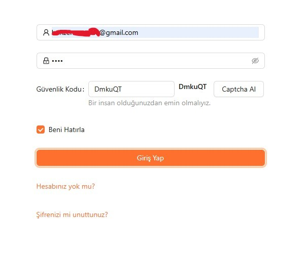
</p>

### 📝 Kullanıcı Kayıt Sayfası
<p align="center">
  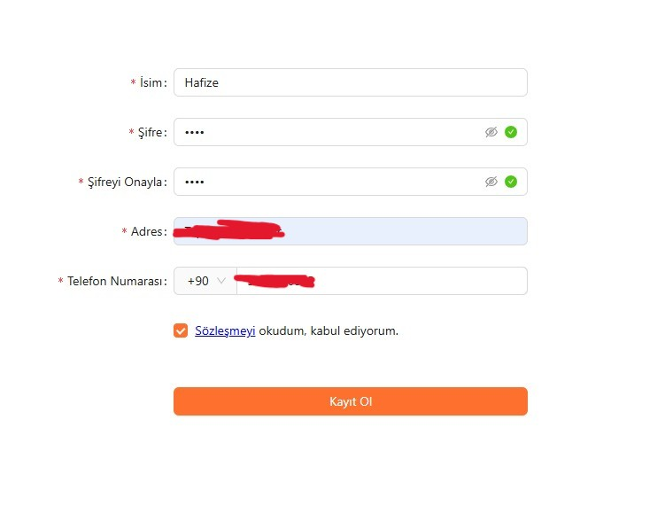
</p>

### 🏠 Kullanıcı Anasayfası
<p align="center">
  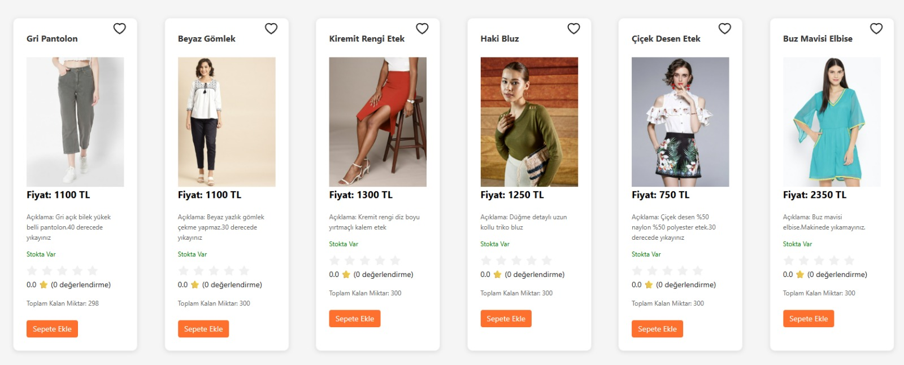
</p>

### 📦 Ürün Detay Sayfası
<p align="center">
  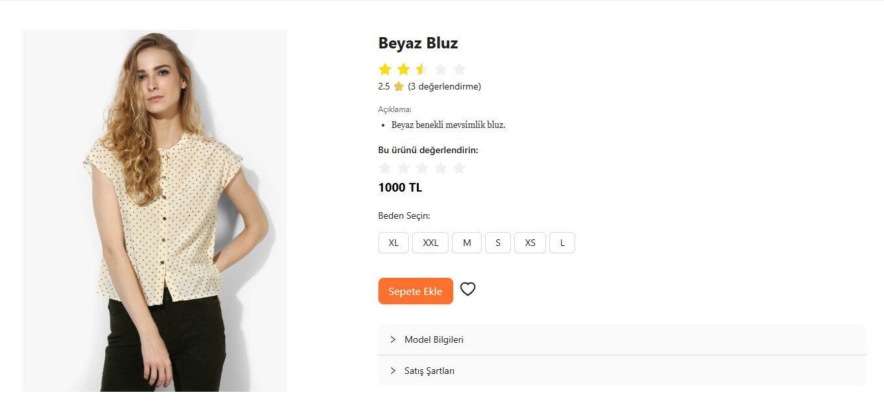
</p>

### 🛒 Ödeme Sayfası
<p align="center">
  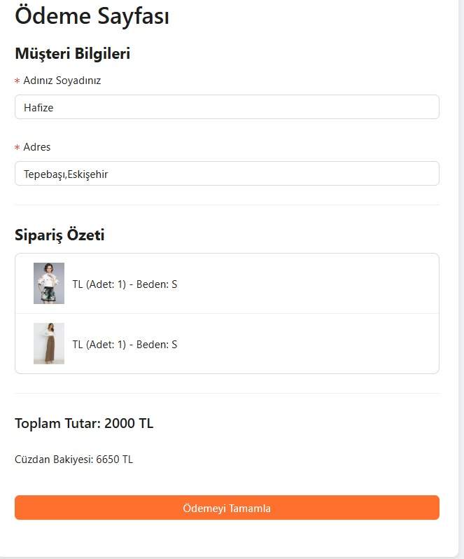
</p>

### 📄 Siparişlerim Sayfası
<p align="center">
  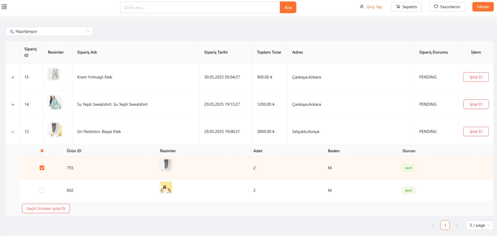
</p>

---

## 🛠️ Admin Arayüzü Özellikleri

- Ürün ekleme, silme ve güncelleme  
- Kategori yönetimi  
- Sipariş yönetimi  
- Kayıtlı kullanıcıları görüntüleme  
- Stok kontrolü  
- Yönetici kontrol paneli (dashboard)

---

## 🖼️ Admin Paneli Görselleri

### 🧾 Sipariş Yönetim Paneli
<p align="center">
  
</p>

### 👥 Kayıtlı Kullanıcılar Sayfası
<p align="center">
  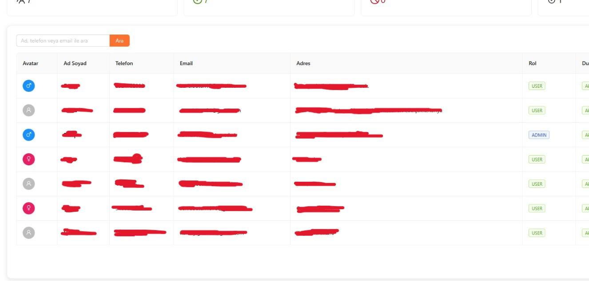
</p>

### 📦 Ürün Yönetim Sayfası
<p align="center">
  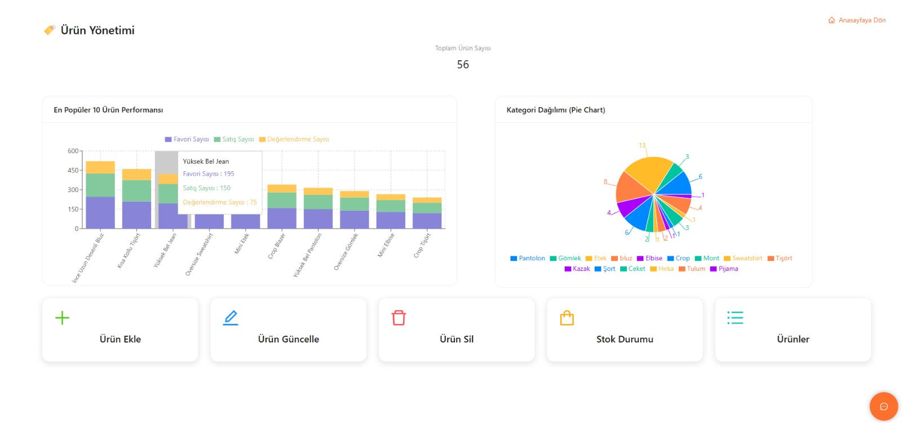
</p>

### 📦 Kayıtlı Ürünler Listesi
<p align="center">
  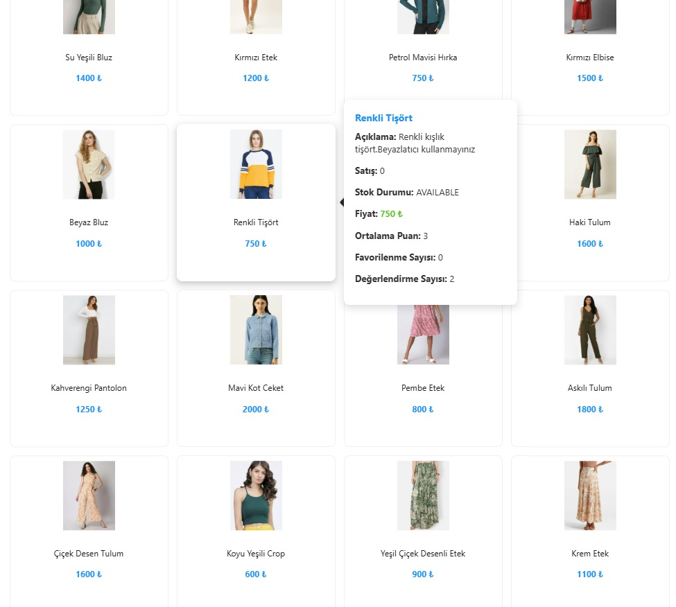
</p>

### 📊 Ürün Stok Takip Sayfası
<p align="center">
  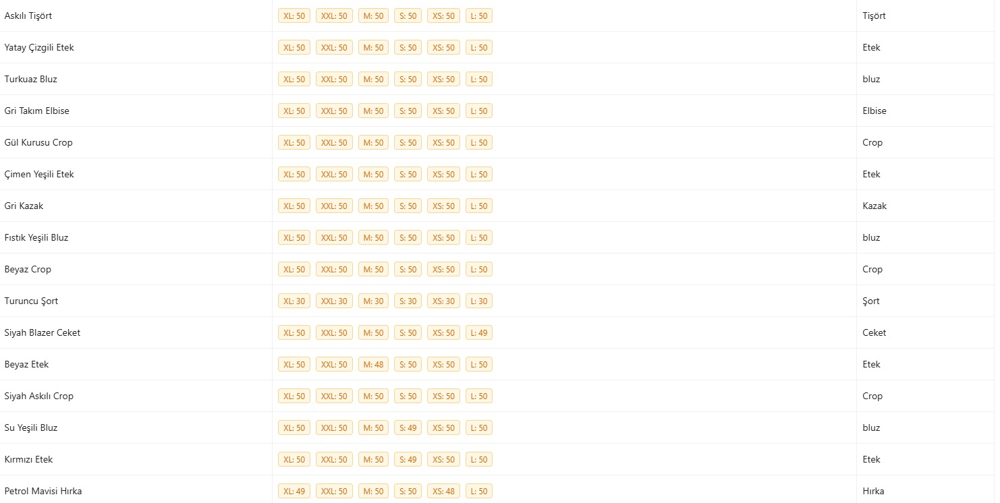
</p>

### 🏠 Admin Anasayfası (Dashboard)
<p align="center">
  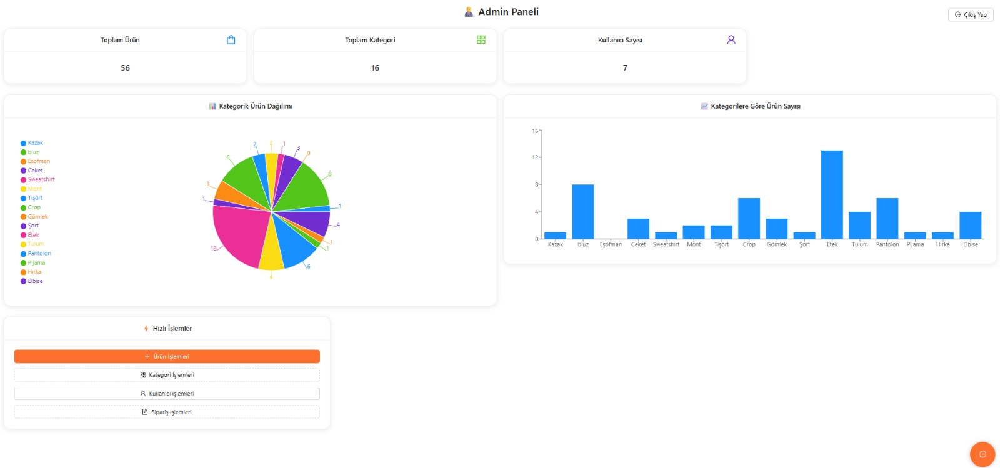
</p>

---

## 🤖 NLP Destekli Chatbot

<p align="center">
  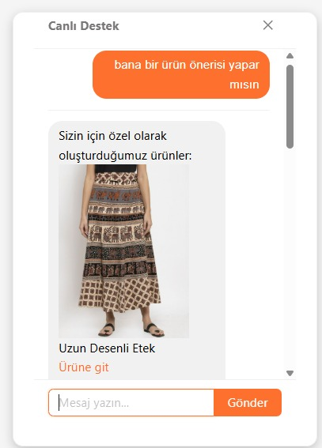
</p>

# 🤖 Chatbot Sistemi

Chatbot sistemi, kullanıcıların ürün arama ve bilgi alma süreçlerini
kolaylaştırmak amacıyla geliştirilmiştir.

---

## 📂 Proje Yapısı (Özet)

```text
Frontend/
└── app/
    ├── src/
    │   ├── components/
    │   ├── pages/
    │   ├── services/
    │   └── routes/
    └── package.json

images/
└── (arayüz ekran görüntüleri)
## ⚙️ Kurulum ve Çalıştırma

```bash
cd Frontend/app
npm install
npm run dev
